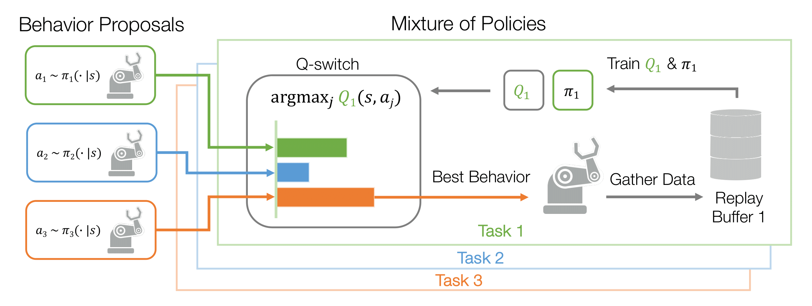
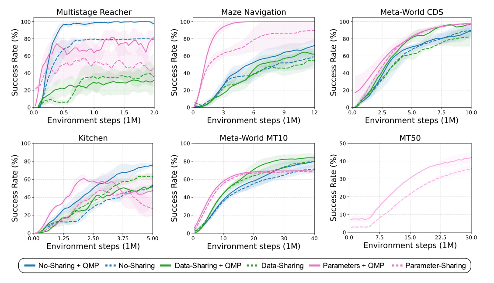

# Efficient Multi-Task Learning via Selective Behavior Sharing
## Accepted to ICLR 2025

[[Project Website]](https://sites.google.com/view/qmp-mtrl) [[Paper]](https://arxiv.org/abs/2302.00671) [[OpenReview]](https://openreview.net/forum?id=aUZEeb2yvK&referrer=%5BAuthor%20Console%5D(%2Fgroup%3Fid%3DICLR.cc%2F2025%2FConference%2FAuthors%23your-submissions))

Grace Zhang<sup>1</sup>, Ayush Jain<sup>1</sup>, Injune Hwang<sup>2</sup>, Shao-Hua Sun<sup>3</sup>, Joseph J. Lim<sup>2</sup>

<sup>1</sup>University of Southern California <sup>2</sup>KAIST <sup>3</sup>National Taiwan University

This is the official implementation of Efficient Multi-Task Learning via Selective Behavior Sharing. 

We propose Q-switch Mixture of Policies (QMP), a simple multi-task RL method that selectively shares behaviors 
between tasks for more sample efficient MTRL. The ability to leverage shared behaviors between tasks is critical for sample efficient multi-task reinforcement learning (MTRL). Prior approaches based on policy distillation share behaviors uniformly across tasks, which is fundamentally limited when 
tasks have conflicting behaviors because no one optimal policy exists. Our key insight is that, we can instead share behavioral policies for off-policy data collection which can be helpful 
even when the optimal behaviors differ and does not require changing the training objective, making it easily compatible with other MTRL methods. Furthermore, we can identify shareable behaviors through the Q-switch, which uses the task's learned Q-function to evaluate action proposals from each policy. To this end, we propose a novel MTRL method, Q-switch Mixture of policies (QMP), that learns to selectively shares
behavior between tasks by using a mixture of policies gated by the Q-switch to gather training data.  We demonstrate that QMP is compatible with and provides complementary gains with many other MTRL methods.

<p align="center">
    
</p>

## Directories
* `run.py` take arguments and initializes experiments
* `garage_experiments.py` defines experiments and starts training
* `learning/`: contains all learning code, baseline implementations, and our method
* `environments/`: registers environments

## Dependencies
* Ubuntu 18.04 or above
* Python 3.8
* Mujoco 2.1 [https://github.com/deepmind/mujoco/releases]
## Installation

To install python dependencies.
   ```bash
   pip install -r requirements.txt
   ```

## Implementing QMP
Our implementation of QMP is based on top of the garage RL codebase [https://github.com/rlworkgroup/garage].  If you would
like to re-implement QMP in your own codebase, it is fairly simple, as we only replace the data collection policy for each 
task, denoted $\pi_i$, with our mixture policy $\pi_i^{mix}$.  We highlight the specific changes we made in this codebase 
below, to aid in re-implementing QMP in a different codebase.

* We first initialize all the task policies and Q-function networks in the `setup` function in `experiment_utils.py`.
We then initialize the mixture policy with all the task policies and Q-functions.
* We define the mixture policy in `learning/policies/qswitch_mixture_policies_wrapper.py`.  Critically, the `get_action` function,
given an input observation and task, samples all policies for candidate actions, uses the task Q-function to evaluate the policies,
and outputs the best action.
* We pass the mixture policy to the sampler to gather data and the individual policies and Q-functions to the RL algorithm to train.


## Example Commands

To run our method in combination with other MTRL methods, follow the example commands below.  Method X and Method X + QMP are always run with the same hyperparameters.  
For data sharing, we tune `unsupervised_quantile` per task, and for parameter sharing, we increase the network size and tune the learning rates, as reported in our paper.
Simply, replace the environment name `--env=JacoReachMT5-v1`, `--env=MazeLarge-10-v0`, `--env=Walker2dMT4-v0`, `--env=MetaWorldCDS-v1`,
`--env=MetaWorldMT10-v2`,`--env=KitchenMTEasy-v0 `, or `--env=MetaWorldMT50-v2`, and update the data and parameter sharing 
hyperparameters (`unsupervised_quantile`, `lr`, `hidden_sizes`) according to the paper.

### Multistage Reacher
* Separated + QMP (Our Method)
  ```bash
  python run.py qmp_dnc --env=JacoReachMT5-v1
  ```
* Separated
  ```bash
  python run.py dnc_sac --env=JacoReachMT5-v1
  ```
* Parameters + QMP (Our Method)
  ```bash
  python run.py qmp_sac --env=JacoReachMT5-v1 --policy_architecture multihead --Q_architecture multihead --lr 0.001 --hidden_sizes 512 512 
  ```
* Parameters
  ```bash
  python run.py mtsac --env=JacoReachMT5-v1 --policy_architecture multihead --Q_architecture multihead --lr 0.001 --hidden_sizes 512 512 
  ```
* Data + QMP (Our Method)
  ```bash
  python run.py qmp_uds_dnc --env=JacoReachMT5-v1 --sharing_quantile 0
  ```
* Data
  ```bash
  python run.py uds_dnc --env=JacoReachMT5-v1 --sharing_quantile 0
  ```


## Main Results
<p align="center">
    
</p>

## Citation
```
@inproceedings{
zhang2025qmp,
title={{QMP}: Q-switch Mixture of Policies for Multi-Task Behavior Sharing},
author={Grace Zhang and Ayush Jain and Injune Hwang and Shao-Hua Sun and Joseph J Lim},
booktitle={The Thirteenth International Conference on Learning Representations},
year={2025},
url={https://openreview.net/forum?id=aUZEeb2yvK}
}
```
